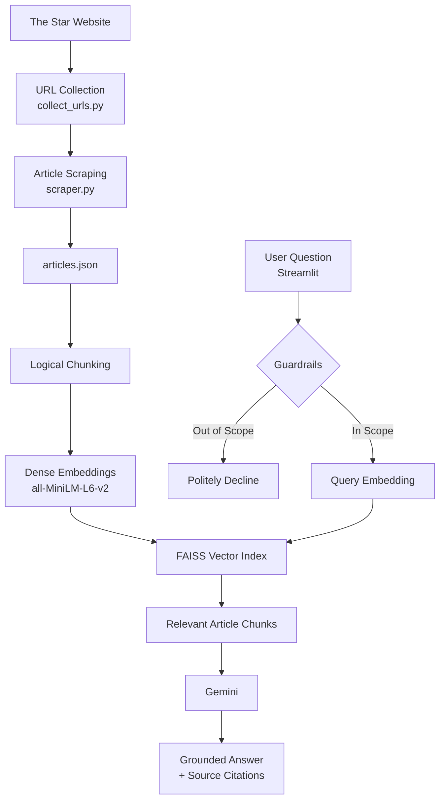

# Architecture & System Design — Johor Election RAG Chatbot

## 1. System Overview

This project implements a Retrieval-Augmented Generation (RAG) prototype that allows users to ask questions about The Star's coverage of the Johor state election.

The system uses real articles scraped from The Star, logical text chunking, dense vector embeddings generated using Sentence Transformers, FAISS for similarity-based retrieval, and Gemini for grounded answer generation.

A rule-based guardrail is applied before retrieval and generation to prevent the system from answering questions outside the intended Johor election scope.

---

## 2. System Design Diagram

The following diagram shows the end-to-end architecture, including the data ingestion pipeline, vector index creation, real-time query pipeline, and safety guardrail path.



### End-to-End Flow

The Star articles are collected and scraped in batch → article metadata and content are stored in `articles.json` → articles are split into overlapping chunks → each chunk is converted into a dense vector embedding using Sentence Transformers → embeddings are indexed in FAISS → a reader submits a question through Streamlit → a rule-based guardrail checks whether the question is within scope → relevant questions are embedded and searched against FAISS → the retrieved article chunks are provided to Gemini as context → Gemini generates a grounded response with source citations.

---

## 3. Component Justification

| Component | Implementation | Why |
|---|---|---|
| **Data ingestion** | Playwright + Requests + BeautifulSoup | Playwright is used to collect dynamically loaded search results from The Star, while Requests and BeautifulSoup are used to retrieve and parse individual article pages. |
| **URL collection** | `collect_urls.py` | Separates article discovery from article content extraction and prevents duplicate article URLs. |
| **Article extraction** | `scraper.py` | Extracts article metadata and article body content from The Star pages. |
| **Dataset orchestration** | `scrape_all.py` | Runs the scraping process across the collected article URLs and saves the final dataset. |
| **Data validation** | `validate_dataset.py` | Checks missing metadata, duplicate URLs/titles, content length, date range, and article categories. |
| **Chunking** | Custom word-based chunking | Uses approximately 120 words per chunk with 30-word overlap. This keeps retrieved context manageable while preserving information across chunk boundaries. |
| **Metadata preservation** | Metadata attached to every chunk | Allows retrieved chunks to be traced back to the original article and used for source citations. |
| **Embedding model** | Sentence Transformers — `all-MiniLM-L6-v2` | Generates dense semantic representations of article chunks and user queries. |
| **Embedding dimension** | 384 | Each chunk and query is represented as a 384-dimensional dense vector by `all-MiniLM-L6-v2`. |
| **Vector retrieval** | FAISS `IndexFlatIP` | Provides similarity search over dense vectors. Normalized embeddings allow inner-product similarity to approximate cosine similarity. |
| **LLM generation** | Gemini | Synthesizes a natural-language response from the retrieved article context while following grounding instructions. |
| **Guardrail** | Rule-based scope and retrieval-confidence checks | Provides a lightweight and explainable mechanism for rejecting clearly out-of-scope questions and questions with insufficient retrieval evidence. |
| **User interface** | Streamlit | Provides a simple interactive chat interface suitable for demonstrating the prototype. |

---

## 4. Safety and Grounding

The system is intentionally restricted to The Star's Johor state election
coverage.

For an out-of-scope question such as:

```text
Who won the Selangor state election?
```

the guardrail rejects the request and provides a polite scope message.

For an in-scope question where the retrieved articles do not contain enough
evidence, the system does not guess. Instead, it acknowledges that the
available context is insufficient.

This helps reduce hallucination and keeps generated answers grounded in the
available article corpus.

---

## 5. Prototype and Production Considerations

The current prototype uses 100 scraped articles and rebuilds the FAISS
index when the application starts.

For production scale, the architecture could be extended with:

- Incremental article ingestion and embedding.
- A persistent vector database or scalable FAISS index.
- Metadata filtering and retrieval re-ranking.
- Scheduled ingestion for newly published articles.
- Retrieval and answer-quality monitoring.
- Human review for sensitive or low-confidence election-related responses.

---

## 6. Known Limitations

- The prototype uses a fixed dataset of 100 articles and does not represent
  the complete coverage of The Star.
- Some multimedia or interactive articles contain limited extractable text.
- Author metadata is not available for every article.
- The FAISS index is rebuilt when the application starts.
- The chatbot can only answer questions supported by the articles in its
  dataset.